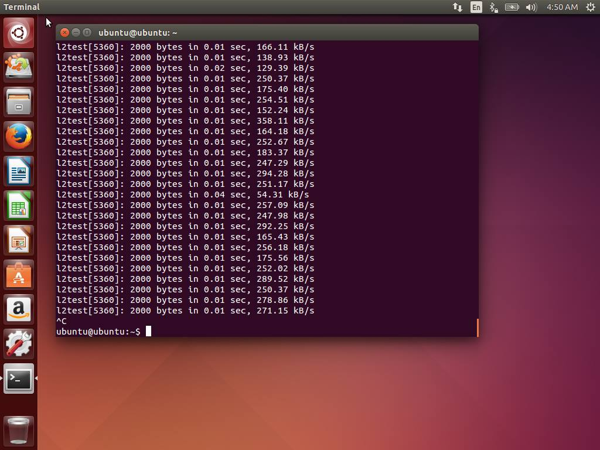

BlueZ - Bluetooth protocol stack for Linux
******************************************

Copyright (C) 2000-2001  Qualcomm Incorporated
Copyright (C) 2002-2003  Maxim Krasnyansky <maxk@qualcomm.com>
Copyright (C) 2002-2010  Marcel Holtmann <marcel@holtmann.org>

Compilation and installation
============================

In order to compile Bluetooth utilities you need following software packages:
	- GCC compiler
	- GLib library
	- D-Bus library
	- udev library (optional)
	- readline (command line clients)

To configure run:
	./configure --prefix=/usr --mandir=/usr/share/man \
				--sysconfdir=/etc --localstatedir=/var

Configure automatically searches for all required components and packages.

To compile and install run:
	make && make install

Configuration and options
=========================

For a working system, certain configuration options need to be enabled:

	--enable-library

		Enable installation of Bluetooth library

		By default the Bluetooth library is no longer installed.

		The user interfaces or command line utilities do not
		require an installed Bluetooth library anymore. This
		option is provided for legacy third party applications
		that still depend on the library.

		When the library installation is enabled, it is a good
		idea to use a separate bluez-library or libbluetooth
		package for it.

	--disable-tools

		Disable support for Bluetooth utilities

		By default the Bluetooth utilities are built and also
		installed. For production systems the tools are not
		needed and this option allows to disable them to save
		build time and disk space.

		When the tools are selected, it is a good idea to
		use a separate bluez-tools package for them.

	--disable-cups

		Disable support for CUPS printer backend

		By default the printer backend for CUPS is build and
		also installed. For systems that do not require printing
		over Bluetooth, this options allows to disable it.

		When the CUPS backend is selected, it is a good idea to
		use a separate bluez-cups package for it.

	--disable-monitor

		Disable support for the Bluetooth monitor utility

		By default the monitor utility is enabled. It provides
		support for HCI level tracing and debugging. For systems
		that don't require any kind of tracing or debugging
		capabilities, this options allows to disable it.

		The monitor utility should be placed in the main package
		along with the daemons. It is universally useful.

	--disable-client

		Disable support for the command line client

		By default the command line client is enabled and uses the
		readline library. For specific systems where BlueZ is
		configured by other means, the command line client can be
		disabled and the dependency on readline is removed.

		The client should be placed in the main package along
		with the daemons. It is universally useful.

	--disable-systemd

		Disable integration with systemd

		By default the integration with systemd is enabled and
		installed. This gives the best integration into all
		distributions based on systemd.

		This option is provided for distributions that do not
		support systemd. In that case all integration with the
		init system is up to the package.

	--enable-experimental

		Enable experimental plugins

		By default all plugins that are still in development
		are disabled. This option can be used to enable them.

		It is not recommended to enable this option for production
		systems. The APIs or behavior of the experimental plugins
		is unstable and might still change.

Information
===========

Mailing lists:
	linux-bluetooth@vger.kernel.org

For additional information about the project visit BlueZ web site:
	http://www.bluez.org
